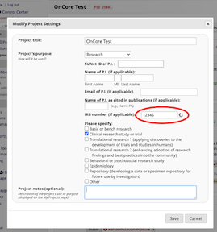
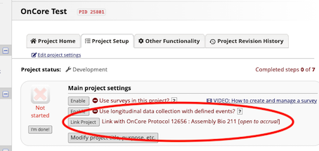
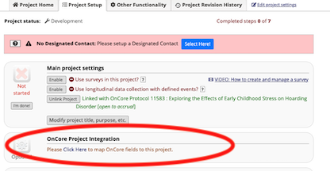
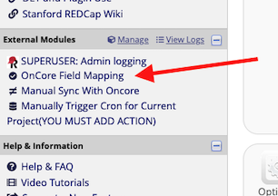
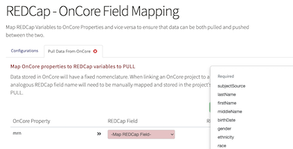
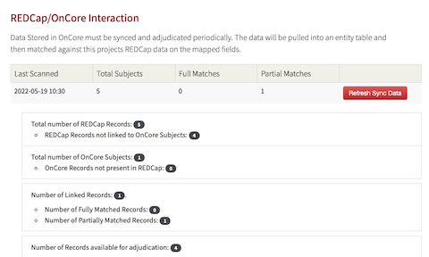
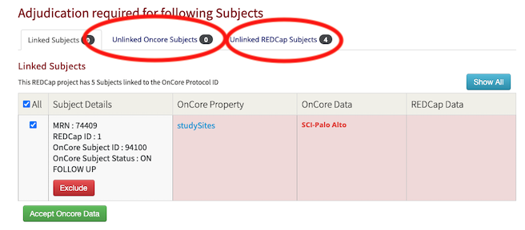

# OnCoreIntegration
Many institutions use the OnCore system by Advarra to manage their clinical trials and also use REDCap to store and capture participant data.  Linking these two systems by automating the transfer of participants between the two systems. This External Module automates the transfer of participant data in a study from REDCap to OnCore and OnCore to REDCap.

This REDCap external module will periodically scan REDCap projects to see if an IRB number is entered. If a number is entered, then OnCore will be scanned for protocols that have the same IRB number.
If a match is found, an option to link the 2 projects will be presented to REDCap users so that Subject data can be shared between the two.  The data on the OnCore side will always be the "Source of Truth".

## Prerequisites
In order to link OnCore and REDCap projects, there are a few requirements which must be satisfied:
  1. Currently, non-cancer studies can be linked.  The ability to link projects to the Cancer Center may be made in the future but is not yet implemented.
  2. Before the linkage can be made, the study must already be created in OnCore and the study must be in OPEN TO ACCURAL status.
  3. Participants can only be transferred between systems for Per-Participant studies and not for Summary Accural Only studies.

## Setup

### Matching a REDCap project with an OnCore project
Each REDCap project that would like to use this functionality, must provide an IRB Number in the REDCap Project Setup page.



If a new REDCap project is being created and will be linked to OnCore, please see the section on <i>Using a project template for new REDCap projects</i>

Once the project is created, this OnCore Integration EM will need to be enabled on the project from a REDCap Administrator.  Once the EM is enabled, the project setup page will display a Link Project button.

### Linking REDCap to OnCore
The Link Project button will be provided on the Project Setup page as seen below.



Once the Link Project button is selected, the projects will be linked.


### Project Fields
Subjects are linked to OnCore based on MRNs. In order to bring data from OnCore into your project, you must have an MRN field created in your project. Any additional data fields are optional.

If your project intends to push Subjects from your REDCap project into OnCore, then there are a list
of fields that are required by OnCore.  If your project does not store all the required fields, the push will not be successful.
The required fields are:
    1. MRN
    2. First Name
    3. Middle Name
    4. Last Name
    5. Date of Birth
    6. Gender
    7. Race
    8. Ethnicity
    9. Study Site
    10. Subject Source

### Using a project template for new REDCap projects
When new REDCap projects are created which intend to use the OnCore linkage, we encourage users to create the project using the Stanford OnCore Template.


Using the template will automatically create a form which includes all the Subject Demographic fields that are available from OnCore. This form helps determine which fields
to use and what the options for each field should be.  Even though the included field options are the only values that OnCore
includes, users have the freedom to add additional choices.  For instance, the values for gender that OnCore accepts are Male, Female and Unknown.  If your research
project would like to include Male assigned at Birth and Female assigned at birth, you can add those options to the field.

For the Study Sites field, you can delete the options that your study will not use.

Fields that will not be populated can be deleted.

## Field Mapping
Once OnCore and REDCap projects are linked, some initial configuration mapping is necessary. Generally, mapping is only performed once
but if the data you want stored from OnCore changes or the data you want to push to OnCore changes, you will need
to revisit the mapping page.

After the OnCore Integration EM is enabled, the Project Setup page has a link to the Field Mapping page:



Once the mapping is completed, further mapping updates will need to be performed using the link on the left-hand sidebar in the External Module section.
The link is called OnCore Field Mapping.



Once on the Field Mapping page, you can select the option to retrieve (pull) OnCore data and store it in your REDCap project and/or
push data from your REDCap project to OnCore.  You are also able to select the study sites you will use in your project.


### Data Mapping for Pulling OnCore Data
In order to `PULL` data from OnCore to REDCap, the MRN is required is auto-selected. The REDCap project MRN field needs to be mapped to this OnCore field.
In addition to MRN, you may select the relevant OnCore Properties from the drop-down one by one, and select the appropriate REDCap field where that OnCore property will be saved.
If there are enumerated fields, a second level mapping field will appear so that the individual REDCap options can be mapped to the OnCore options.



### Data Mapping for Pushing REDCap data to OnCore
In order to `PUSH` Subject data from REDCap to OnCore, there are a **miniumum** set of fields required by mapping a core subset of OnCore Properties to their REDCap counterparts.
If the requirements are not met, the push will fail. The minimum set of fields is listed when you go to the <i>Push Data to OnCore</i> tab.


Not all required fields are shown in the picture above.

If there are other fields that you would like to push to OnCore, such as address, city, state, zip code, etc. select the <i>Show Optional OnCore Properties</i> button
to map additional Subject properties.

Once the Pull and Push mappings are complete, you can perform the Pull and Push sync actions.

## Perform a sync with OnCore

To find out which OnCore subjects are not in your new REDCap project, go to the Manual Sync link located in the left hand sidebar under External Modules.


This page will give an overview of the status of your REDCap and OnCore records as of the <i>Last Scanned</i> timestamp.  To update your project, you may select the
<i>Refresh Sync Data</i> button to re-scan OnCore and refresh your status.



Once your project is refreshed, you can go to the <i>Unlinked OnCore Subjects</i> tab and/or the <i>Unlinked REDCap Subjects</i> tab to adjudicate the subjects.



## Adjudication
The EM will take the mapping data and do a daily (or manual) scan/sync against the OnCore API using a subject's **MRN** to find matches.  If data is found it will be assigned 3 possible statuses; "Partial Match", "OnCore only", "REDCap only".

### Partial Match
The data was found in both the REDCap Project and its OnCore counterpart.  But there was a discrepency in one or more properties/fields.   In these instances, OnCore being the "source of truth" will overwrite the data in the mapped REDCap field unless that subject is "excluded".

### OnCore Only
Subjects are found in the OnCore Protocol but no matching MRN was found in the REDCap project.  In this instance, all the subjects and their mapped data are pulled into REDCap from OnCore unless "excluded".

### REDCap Only
Subjects are found in the REDCap project but no matching MRN was found in the OnCore Protocol.  In this instance all the subjects and their mapped data are pushed into OnCore from REDCap unless "excluded".


## OnCore Fields Definition Example:

```json
{
    "subjectDemographicsId": {
        "alias": "",
        "description": "subject Demographics Id",
        "oncore_field_type": [
            "string"
        ],
        "oncore_valid_values": [],
        "required": "false"
    },
    "subjectSource": {
        "alias": "",
        "description": "subject Source",
        "oncore_field_type": [
            "text"
        ],
        "oncore_valid_values": [],
        "required": "true"
    },
    "mrn": {
        "alias": "",
        "description": "MRN",
        "oncore_field_type": [
            "text"
        ],
        "oncore_valid_values": [],
        "required": "true"
    },
    "lastName": {
        "alias": "",
        "description": "last Name",
        "oncore_field_type": [
            "text"
        ],
        "oncore_valid_values": [],
        "required": "true"
    },
    "firstName": {
        "alias": "",
        "description": "first Name",
        "oncore_field_type": [
            "text"
        ],
        "oncore_valid_values": [],
        "required": "true"
    },
    "middleName": {
        "alias": "",
        "description": "middle Name",
        "oncore_field_type": [
            "text"
        ],
        "oncore_valid_values": [],
        "required": "true"
    },
    "suffix": {
        "alias": "",
        "description": "suffix",
        "oncore_field_type": [
            "text"
        ],
        "oncore_valid_values": [],
        "required": "false"
    },
    "birthDate": {
        "alias": "",
        "description": "Date of Birth",
        "oncore_field_type": [
            "text"
        ],
        "oncore_valid_values": [],
        "required": "true"
    },
    "approximateBirthDate": {
        "alias": "",
        "description": "approximate Birth Date",
        "oncore_field_type": [
            "bool"
        ],
        "oncore_valid_values": [],
        "required": "false"
    },
    "birthDateNotAvailable": {
        "alias": "",
        "description": "birth Date Not Available",
        "oncore_field_type": [
            "bool"
        ],
        "oncore_valid_values": [],
        "required": "false"
    },
    "expiredDate": {
        "alias": "",
        "description": "expired Date",
        "oncore_field_type": [
            "text"
        ],
        "oncore_valid_values": [],
        "required": "false"
    },
    "approximateExpiredDate": {
        "alias": "",
        "description": "approximate Expired Date",
        "oncore_field_type": [
            "bool"
        ],
        "oncore_valid_values": [],
        "required": "false"
    },
    "lastDateKnownAlive": {
        "alias": "",
        "description": "last Date Known Alive",
        "oncore_field_type": [
            "text"
        ],
        "oncore_valid_values": [],
        "required": "false"
    },
    "ssn": {
        "alias": "",
        "description": "Social Security Number",
        "oncore_field_type": [
            "text"
        ],
        "oncore_valid_values": [],
        "required": "false"
    },
    "gender": {
        "alias": "",
        "description": "Gender",
        "oncore_field_type": [
            "text"
        ],
        "oncore_valid_values": [
            "Male",
            "Female",
            "Unknown"
        ],
        "required": "true"
    },
    "ethnicity": {
        "alias": "",
        "description": "Ethnicity",
        "oncore_field_type": [
            "text"
        ],
        "oncore_valid_values": [
            "Hispanic or Latino",
            "Non-Hispanic",
            "NOTE - Use Unknown For Not Reported",
            "Unknown"
        ],
        "required": "true"
    },
    "race": {
        "alias": "",
        "description": "Race",
        "oncore_field_type": [
            "array"
        ],
        "oncore_valid_values": [
            "White",
            "Black or African American",
            "Native Hawaiian or Other Pacific Islander",
            "Asian",
            "American Indian or Alaska Native",
            "Not Reported",
            "Unknown"
        ],
        "required": "true"
    },
    "subjectComments": {
        "alias": "",
        "description": "subject Comments",
        "oncore_field_type": [
            "text"
        ],
        "oncore_valid_values": [],
        "required": "false"
    },
    "additionalSubjectIds": {
        "alias": "",
        "description": "additional Subject Ids",
        "oncore_field_type": [
            "array"
        ],
        "oncore_valid_values": [],
        "required": "false"
    },
    "streetAddress": {
        "alias": "",
        "description": "street Address",
        "oncore_field_type": [
            "text"
        ],
        "oncore_valid_values": [],
        "required": "false"
    },
    "addressLine2": {
        "alias": "",
        "description": "address Line 2",
        "oncore_field_type": [
            "text"
        ],
        "oncore_valid_values": [],
        "required": "false"
    },
    "city": {
        "alias": "",
        "description": "City",
        "oncore_field_type": [
            "text"
        ],
        "oncore_valid_values": [],
        "required": "false"
    },
    "state": {
        "alias": "",
        "description": "State",
        "oncore_field_type": [
            "text"
        ],
        "oncore_valid_values": [],
        "required": "false"
    },
    "zip": {
        "alias": "",
        "description": "ZIP",
        "oncore_field_type": [
            "text"
        ],
        "oncore_valid_values": [],
        "required": "false"
    },
    "county": {
        "alias": "",
        "description": "County",
        "oncore_field_type": [
            "text"
        ],
        "oncore_valid_values": [],
        "required": "false"
    },
    "country": {
        "alias": "",
        "description": "Country",
        "oncore_field_type": [
            "text"
        ],
        "oncore_valid_values": [],
        "required": "false"
    },
    "phoneNo": {
        "alias": "",
        "description": "Phone",
        "oncore_field_type": [
            "text"
        ],
        "oncore_valid_values": [],
        "required": "false"
    },
    "alternatePhoneNo": {
        "alias": "",
        "description": "alternate Phone",
        "oncore_field_type": [
            "text"
        ],
        "oncore_valid_values": [],
        "required": "false"
    },
    "email": {
        "alias": "",
        "description": "Email",
        "oncore_field_type": [
            "text"
        ],
        "oncore_valid_values": [],
        "required": "false"
    }
}
```
